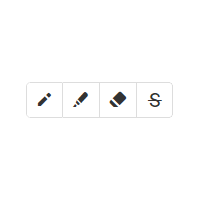
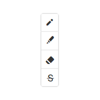
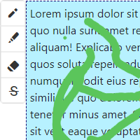
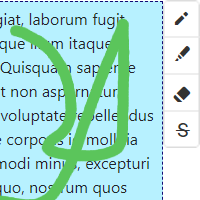
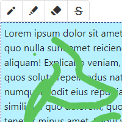
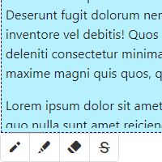
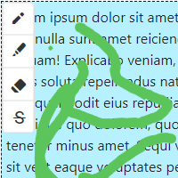

# How to use painter.js

It's possible to have multiple painters on one page.

```javascript
$("#component id").addPainter(options);
```

### Example

Example for image element:

```javascript
$("#myImg").addPainter({
  type: "img",
  toolbar: {
    alignment: "top left vertical outside",
    offsets: [-10, 0],
  },
});
```

# Options object

## Attributes

- [idNumberLenght](#oinl)
- [type](#ot)
- [toolbar](#otr)
  - [alignment](#otra)
  - [alignmentProcessed](#otrap)
    - [axis](#otrapa)
    - [posX](#otrappx)
    - [posY](#otrappy)
    - [posToBorder](#otrapptb)
  - [offsets](#otros)

### <a name="oinl"></a> **idNumberLenght**

```javascript
type: Number (int)
validValues: 0+
default: 8
description: "number of digits in id"
```

### <a name="ot"></a> **type**

```javascript
type: String
validValues: "dx-scrollview" || "div" || "img"
default: "dx-scrollview"
description: "type / mode of the painter"
```

### <a name="otr"></a> **toolbar**

```javascript
type: Object
structure: {
    alignment: toolbar.alignment,
    alignmentProcessed: toolbar.alignmentProcessed,
    offsets: toolbar.offsets
}

description: "buttons to control the painter with"
```

### <a name="otra"></a> toolbar.alignment

```javascript
type: String
validValues:
"*conbination of valid toolbar.alignmentProcessed atributes in any order*"
default: "horizontal bottom right inside"
description: "fast way to define position of the toolbar"
```

### <a name="otrap"></a> toolbar.alignmentProcessed

```javascript
type: Object
structure: {
    axis: toolbar.alignmentProcessed.axis,
    posX: toolbar.alignmentProcessed.posX,
    posY: toolbar.alignmentProcessed.posY,
    posToBorder: toolbar.alignmentProcessed.posToBorder,
}

description:
"alignmentProcessed is automatically set by toolbar.alignment and is internally used to place toolbar to the desired position"
```

### <a name="otrapa"></a> toolbar.alignmentProcessed.axis

```javascript
type: String
validValues: "horizontal" || "vertical"
default: "horizontal"
description: "defines, whether the toolbar is rendered horizontally or vertically"
```

|            horizontal             |           vertical            |
| :-------------------------------: | :---------------------------: |
|  |  |

### <a name="otrappx"></a> toolbar.alignmentProcessed.posX

```javascript
type: String
validValues: "left" || "right"
default: "right"
description: "defines, whether the toolbar is rendered on the left or on the right of the element to draw on"
```

|         left          |          right          |
| :-------------------: | :---------------------: |
|  |  |

### <a name="otrappy"></a> toolbar.alignmentProcessed.posY

```javascript
type: String
validValues: "top" || "bottom"
default: "top"
description: "defines, whether the toolbar is rendered on the top or on the bottom of the element to draw on"
```

|         top         |          bottom           |
| :-----------------: | :-----------------------: |
|  |  |

### <a name="otrapptb"></a> toolbar.alignmentProcessed.posY

```javascript
type: String
validValues: "outside" || "inside"
default: "outside"
description: "defines, whether the toolbar is rendered on the outside or on the inside of the element to draw on"
```

|           outside           |          inside           |
| :-------------------------: | :-----------------------: |
|  |  |

### <a name="otros"></a> toolbar.offsets

```javascript
type: Array
validValues: [Number, Number]
default: [0, 0]
description: "addidional toolbar offset relative to set position"
```
